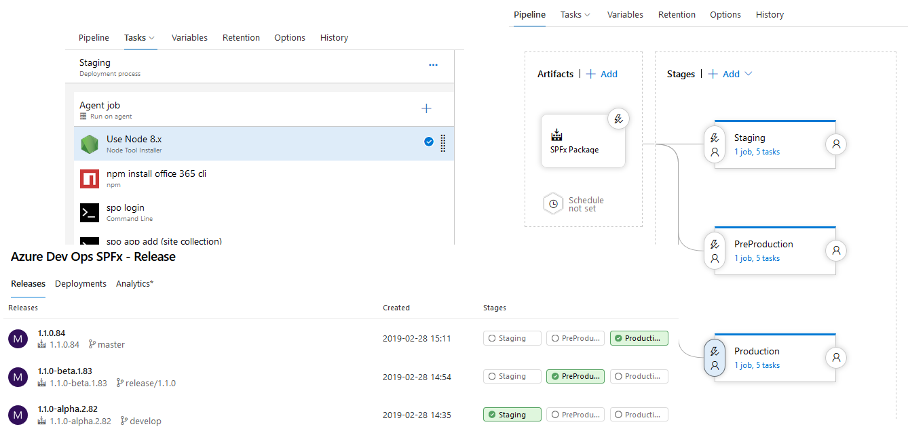

## Azure DevOps with SPFx, GitFlow and GitVersion

This solution demonstrates how to integrate SPFx solutions with Azure DevOps, GitFlow and GitVersion.

The following files are available:

- `build.json`: the build pipeline definitionTo be adapted to your context.
- `release.json`: the release pipeline definition. To be adapted to your context.
- `gulpfile.js`: gulp tasks used in association with Azure DevOps. To be adapted to your SPFx structure.

# Documentation 

A complete blog post is available here explaining the pipeline: 

[http://thecollaborationcorner.com/2019/02/28/azure-devops-with-spfx-gitflow-gitversion/](http://thecollaborationcorner.com/2019/02/28/azure-devops-with-spfx-gitflow-gitversion/)

