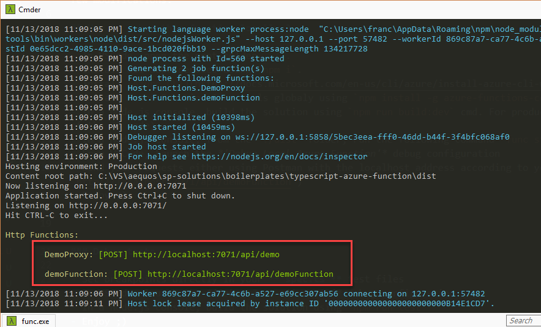
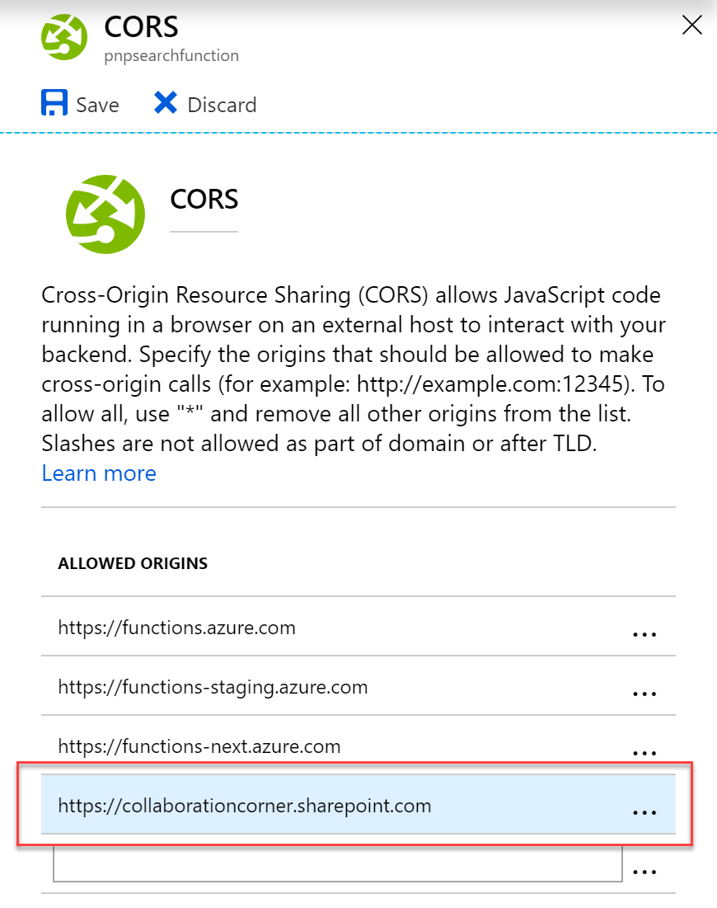

# TypeScript Azure Function boilerplate

## Description

TypeScript Azure Function boilerplate project that can be used to build SPFx back end services. The original project structure has been taken from this [article](https://medium.com/burak-tasci/backend-development-on-azure-functions-with-typescript-56113b6be4b9) with only few modifications. 

## How to debug this function locally ?

- In VSCode, open the root folder `./`.
- Install all dependencies using `npm i`.
- Install [Azure CLI](https://docs.microsoft.com/en-us/cli/azure/install-azure-cli-windows?view=azure-cli-latest) on youre machine.
- Install Azure Function Core tools globaly using `npm install -g azure-functions-core-tools@2` (version 2).
- In a Node.js console, build the solution using `npm run build:dev` cmd. For production use, execute `npm run build` (minified version of the JS code).
- In a Node.js console, from the `./dist` folder, run the following command `func start`.
- From VSCode, Launch the *'Debug Local Azure Function'* debug configuration 
- Send your requests either using Postman with the localhost address according to your settings (i.e. `http://localhost:7071/api/demoFunction`)
- Enjoy ;)

### Debug tests

- Set breakpoints directly in your **'spec.ts'** test files
- In VSCode, launch the *'Debug Jest all tests'* debug configuration
- In a Node.js console, build the solution using `npm run test`
- Enjoy ;)

### Azure Function Proxy configuration ###

This solution uses an Azure function proxy to get an only single endpoint URL for multiple functions. See the **proxies.json** file to see defined routes.

## How to deploy the solution to Azure ? ##

### Development scenario

We recommend to use Visual Studio Code to work with this solution.

- In VSCode, download the [Azure Function](https://code.visualstudio.com/tutorials/functions-extension/getting-started) extension
- Sign-in to to Azure account into the extension
- In a Node.js console, build the application using the command `npm run build` (minified version)
- Use the **"Deploy to Function App"** feature (in the extension top bar) using the *'dist'* folder. Make sure you've run the `npm run build` cmd before.
- Upload the application settings file according to your environment (`local.settings.json`)

### Production scenario with CI

A `deploy.ps1` script is available to also deploy this function into your Azure environment.

- From you Azure portal, create a new empty function
- Set the `Azure_Function_Name` value in the `local.settings.json` accordingly.
- Login to Azure using `az login` then run `deploy.ps1` script with your parameters.
- Don't hesitate to refactor this to adapt to your situation.

***In both scenarios, you can test your function using Postman. If you test it using a SPFx component, don't forget to add the SharePoint domain to the CORS settings to allow this origin:***

